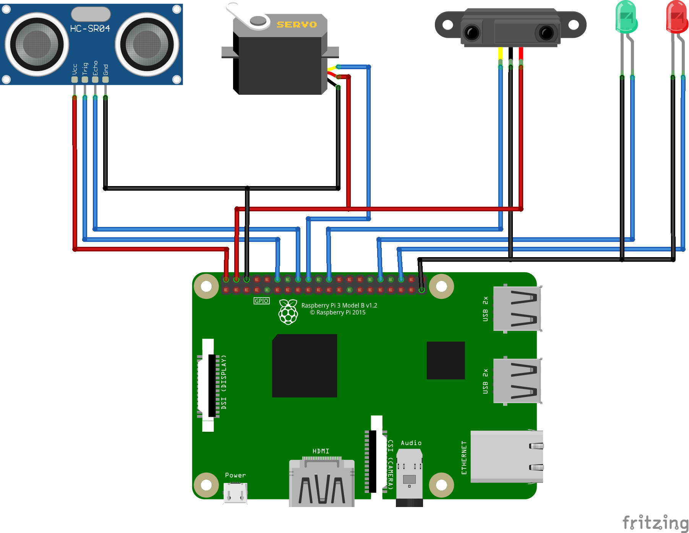

# Smart Dustbin

This is a project to build a smart dustbin that can be used to monitor the amount of waste in the dustbin. When the dustbin is full, it turns the red LED.

## Functionalities

- Detects if the dustbin is full or not
- Turns on the red LED when the dustbin is full (above a threshold)
- Turns the green LED when the dustbin is not full
- Open the lid of the dustbin when someone approaches it

## Components

- Raspberry Pi 3
- Ultrasonic Sensor
- LED
- Servo Motor
- IR Sensor

## Circuit Diagram

