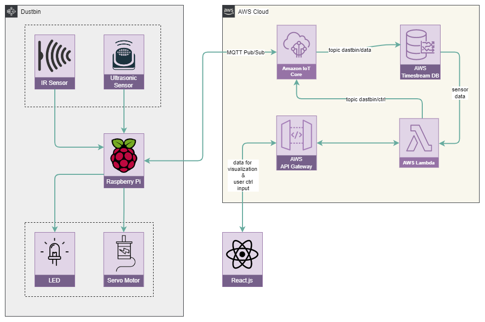

# Smart Dustbin

This is a project to build a smart dustbin that can be used to monitor the amount of waste in the dustbin. When the dustbin is full, it turns the red LED.

## Architecture

## Technology Stack

- [Raspberry Pi](https://www.raspberrypi.org/) - To collect the data from the sensors and send it to the cloud. Also, to control the peripherals.
- [Python](https://www.python.org/) - To write the code for the Raspberry Pi.
- [MQTT](https://mqtt.org/) - To send the data from the Raspberry Pi to the cloud.
- [AWS IoT Core](https://aws.amazon.com/iot-core/) - To work as a MQTT broker and control the data flow.
- [AWS Timestream](https://aws.amazon.com/timestream/) - To store the data in the cloud.
- [AWS Lambda](https://aws.amazon.com/lambda/) - To process the data and and work as a backend for the web application.
- [React](https://reactjs.org/) - To build the web application.

## Hardware

- __Raspberry Pi Zero 2 W__ - To collect the data from the sensors and send it to the cloud. Also, to control the peripherals.
- __HC-SR04 Ultrasonic Sensor__ To measure the distance between the dustbin and the ground.
- __LEDs__ - To indicate the status of the dustbin.
- __Servo Motor__ - To open the dustbin lid.

## Functionalities

- Measure the remaining capacity of the dustbin.
- Open the dustbin lid when someone approaches.
- Turn on the red LED when the dustbin is full.
- Turn on the green LED when the dustbin is not full.
- Send the data to the cloud.
- Store the data in the cloud.
- Display the data in the web application.
- Control the dustbin from the web application.

## License

This project is licensed under the MIT License - see the [LICENSE](LICENSE) file for details.
